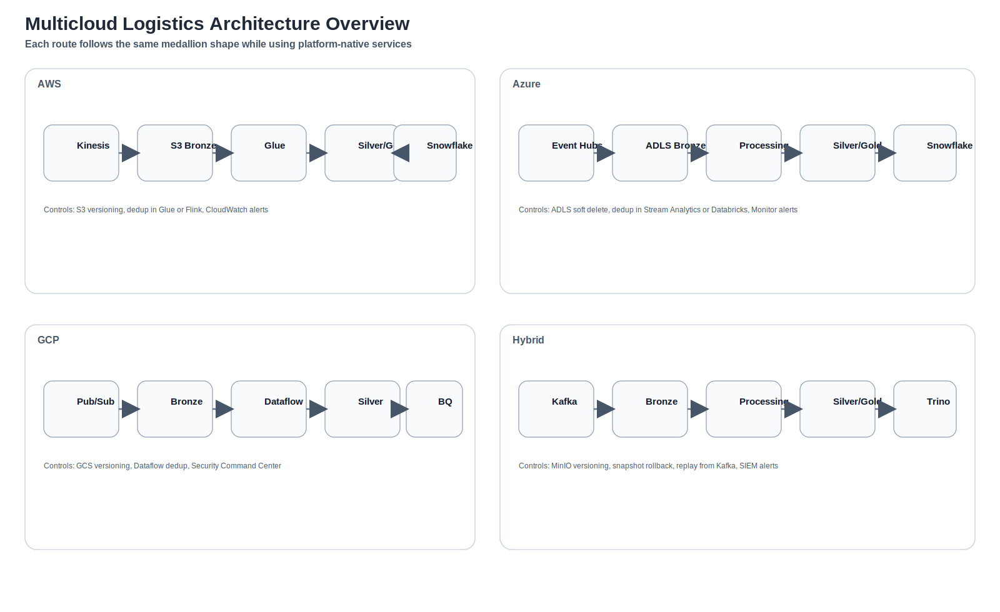

# Architecture Workflows

Each route uses the same architectural shape:

- replayable ingestion
- immutable bronze
- deduplicating and validating processing
- curated silver and gold
- controlled serving

What changes is the platform-native implementation:

- AWS: `Kinesis -> S3 -> Glue/Flink -> S3 -> Snowflake`
- Azure: `Event Hubs -> ADLS -> Stream Analytics/Databricks -> ADLS -> Snowflake`
- GCP: `Pub/Sub -> Cloud Storage -> Dataflow -> Cloud Storage -> BigQuery`
- Hybrid: `Kafka -> MinIO -> Spark/Flink -> MinIO/Iceberg -> Trino`
